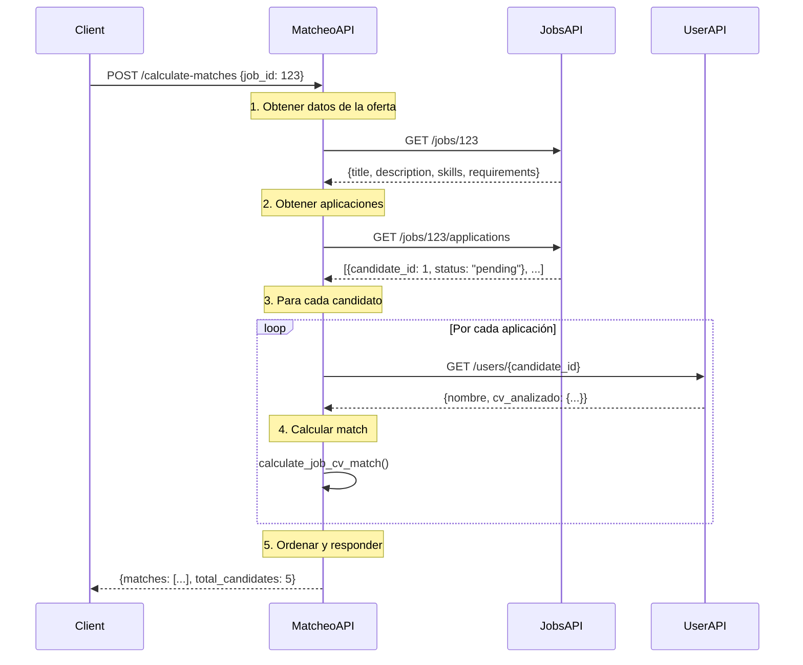

# MatcheoAPI - Guía Técnica Completa

## 📋 Descripción General

La **MatcheoAPI** es el componente central de orquestación del sistema de matching entre ofertas laborales y candidatos. Funciona como un microservicio que coordina las otras APIs para calcular compatibilidad entre CVs analizados y ofertas de trabajo.

### 🎯 Función Principal
**Calcular el porcentaje de compatibilidad entre una oferta laboral específica y todos los candidatos que se han postulado a ella.**

---

## 🏗 Arquitectura y Diseño

### Principio de Orquestación
```
┌─────────────────┐    ┌─────────────────┐    ┌─────────────────┐
│    JobsAPI      │    │    UserAPI      │    │ CvAnalyzerAPI   │
│   (Puerto 8002) │    │   (Puerto 8000) │    │   (Puerto 8001) │
└─────────┬───────┘    └─────────┬───────┘    └─────────┬───────┘
          │                      │                      │
          │                      │                      │
          └──────────────────────┼──────────────────────┘
                                 │
                        ┌────────▼────────┐
                        │   MatcheoAPI    │
                        │   (Puerto 8003) │
                        │                 │
                        │ ┌─────────────┐ │
                        │ │  Algoritmo  │ │
                        │ │  Matching   │ │
                        │ └─────────────┘ │
                        └─────────────────┘
```

### Características Clave:
- **Sin Base de Datos Propia**: Orquesta datos de otras APIs
- **Stateless**: Cada request es independiente
- **Algoritmo de Matching**: Lógica de cálculo de compatibilidad
- **Agregación de Datos**: Combina información de múltiples fuentes

---

## 🔄 Flujo de Funcionamiento

### Proceso de Matching Completo:



---

## 📡 API Endpoints

### 1. **POST /calculate-matches**
Endpoint principal para calcular matching.

#### Request:
```json
{
    "job_id": 123
}
```

#### Response:
```json
{
    "job_id": 123,
    "job_title": "Desarrollador Python Senior",
    "total_candidates": 5,
    "matches": [
        {
            "candidate_id": 1,
            "candidate_name": "Juan Pérez",
            "application_id": 456,
            "match_percentage": 85.5,
            "match_details": {
                "skills_match": 90,
                "experience_match": 80,
                "education_match": 85,
                "overall_score": 85.5
            },
            "application_status": "pending"
        },
        {
            "candidate_id": 2,
            "candidate_name": "María González",
            "application_id": 457,
            "match_percentage": 72.3,
            "match_details": {
                "skills_match": 75,
                "experience_match": 70,
                "education_match": 80,
                "overall_score": 72.3
            },
            "application_status": "pending"
        }
    ]
}
```

### 2. **GET /job/{job_id}/quick-match**
Versión rápida que retorna solo top 5 candidatos.

#### Response:
```json
{
    "job_id": 123,
    "job_title": "Desarrollador Python Senior",
    "total_candidates": 15,
    "top_matches": [
        {
            "candidate_id": 1,
            "candidate_name": "Juan Pérez",
            "match_percentage": 85.5
        }
    ]
}
```

### 3. **GET /health**
Health check del servicio.

---

## 🧮 Algoritmo de Matching

### Ubicación del Código:
```python
# services/matcheo_service.py
def calculate_job_cv_match(job_data: dict, cv_analizado: dict) -> dict:
```

### Factores de Evaluación:

#### 1. **Skills Matching (40% del peso)**
```python
def calculate_skills_match(job_skills, cv_skills):
    """
    Compara habilidades requeridas vs habilidades del candidato
    """
    job_skills_lower = [skill.lower() for skill in job_skills]
    cv_skills_lower = [skill.lower() for skill in cv_skills]
    
    matches = len(set(job_skills_lower) & set(cv_skills_lower))
    total_required = len(job_skills_lower)
    
    return (matches / total_required) * 100 if total_required > 0 else 0
```

#### 2. **Experience Matching (35% del peso)**
```python
def calculate_experience_match(job_experience, cv_experience):
    """
    Evalúa experiencia laboral relevante
    """
    # Busca experiencia en empresas/roles similares
    # Considera años de experiencia
    # Evalúa progresión profesional
```

#### 3. **Education Matching (25% del peso)**
```python
def calculate_education_match(job_education, cv_education):
    """
    Compara formación académica requerida vs obtenida
    """
    # Nivel educativo (técnico, universitario, posgrado)
    # Área de estudio relevante
    # Certificaciones adicionales
```

### Cálculo Final:
```python
overall_score = (
    skills_score * 0.40 +
    experience_score * 0.35 +
    education_score * 0.25
)
```

---

## 🚀 Cómo Hacer Correr MatcheoAPI

### Prerequisitos

#### 1. **Dependencias del Sistema**
```bash
# Python 3.10+
python --version

# Dependencias Python
pip install fastapi uvicorn requests pydantic python-dotenv
```

#### 2. **APIs Dependientes Funcionando**
Verificar que estén corriendo:
- **JobsAPI** en puerto 8002
- **UserAPI** en puerto 8000
- **CvAnalyzerAPI** en puerto 8001 (opcional para matching)

#### 3. **Estructura de Directorios**
```
APIs/MatcheoAPI/
├── main.py                 # Aplicación FastAPI principal
├── services/
│   └── matcheo_service.py  # Lógica del algoritmo
├── requirements.txt        # Dependencias
├── .env                   # Variables de entorno
└── README.md
```

### Instalación Paso a Paso

#### 1. **Navegar al Directorio**
```bash
cd /Users/lucilagomez/Documents/Proyectos/TrabajoFinal/APIs/MatcheoAPI
```

#### 2. **Crear Entorno Virtual**
```bash
python -m venv venv

# Activar (macOS/Linux)
source venv/bin/activate

# Activar (Windows)
venv\Scripts\activate
```

#### 3. **Instalar Dependencias**
```bash
pip install -r requirements.txt
```

#### 4. **Configurar Variables de Entorno**
```bash
# Crear archivo .env
cat > .env << EOF
JOBS_API_URL=http://localhost:8002
USER_API_URL=http://localhost:8000
CVANALYZER_API_URL=http://localhost:8001
DEBUG=True
EOF
```

#### 5. **Verificar Configuración**
```python
# test_connection.py
import requests

def test_apis():
    apis = {
        "JobsAPI": "http://localhost:8002/health",
        "UserAPI": "http://localhost:8000/health"
    }
    
    for name, url in apis.items():
        try:
            response = requests.get(url, timeout=5)
            print(f"✅ {name}: {response.status_code}")
        except Exception as e:
            print(f"❌ {name}: {e}")

if __name__ == "__main__":
    test_apis()
```

### Ejecución

#### 1. **Modo Desarrollo**
```bash
# Opción 1: Uvicorn directo
uvicorn main:app --host 127.0.0.1 --port 8003 --reload

# Opción 2: Python directo
python main.py

# Opción 3: Con logs detallados
uvicorn main:app --host 127.0.0.1 --port 8003 --log-level debug --reload
```

#### 2. **Modo Producción**
```bash
# Con Gunicorn
pip install gunicorn
gunicorn main:app -w 4 -k uvicorn.workers.UvicornWorker --bind 127.0.0.1:8003

# Con systemd (Linux)
sudo systemctl start matcheo-api
sudo systemctl enable matcheo-api
```

#### 3. **Con Docker**
```dockerfile
# Dockerfile
FROM python:3.10-slim

WORKDIR /app
COPY requirements.txt .
RUN pip install -r requirements.txt

COPY . .
EXPOSE 8003

CMD ["uvicorn", "main:app", "--host", "0.0.0.0", "--port", "8003"]
```

```bash
# Build y run
docker build -t matcheo-api .
docker run -p 8003:8003 --env-file .env matcheo-api
```

### Verificación de Funcionamiento

#### 1. **Health Check**
```bash
curl http://localhost:8003/health

# Respuesta esperada:
{
    "status": "healthy",
    "service": "MatcheoAPI"
}
```

#### 2. **Test de Matching**
```bash
curl -X POST "http://localhost:8003/calculate-matches" \
     -H "Content-Type: application/json" \
     -d '{"job_id": 1}'

# Respuesta esperada:
{
    "job_id": 1,
    "job_title": "...",
    "total_candidates": 3,
    "matches": [...]
}
```

#### 3. **Documentación Automática**
```bash
# Swagger UI
open http://localhost:8003/docs

# ReDoc
open http://localhost:8003/redoc
```

---

## 🐛 Troubleshooting

### Problemas Comunes:

#### 1. **Error de Conexión a APIs**
```bash
# Síntoma
ERROR: connection to server at "localhost", port XXXX failed

# Solución
# Verificar que las APIs dependientes estén corriendo
ps aux | grep uvicorn
netstat -an | grep :8000
netstat -an | grep :8002
```

#### 2. **Timeout en Requests**
```python
# En main.py, ajustar timeouts
import requests

def get_with_retry(url, retries=3, timeout=10):
    for i in range(retries):
        try:
            return requests.get(url, timeout=timeout)
        except requests.Timeout:
            if i == retries - 1:
                raise
            time.sleep(2 ** i)  # Backoff exponencial
```

#### 3. **Error de CORS**
```python
# En main.py, verificar configuración
app.add_middleware(
    CORSMiddleware,
    allow_origins=["http://localhost:4200"],  # Frontend
    allow_credentials=True,
    allow_methods=["GET", "POST", "PUT", "DELETE"],
    allow_headers=["*"],
)
```

#### 4. **Datos Inconsistentes**
```python
# Validar respuestas de APIs
def validate_job_data(job_data):
    required_fields = ["id", "title", "description"]
    for field in required_fields:
        if field not in job_data:
            raise ValueError(f"Missing field: {field}")
```

---

## 📊 Monitoreo y Logs

### Configuración de Logging:
```python
import logging

logging.basicConfig(
    level=logging.INFO,
    format='%(asctime)s - %(name)s - %(levelname)s - %(message)s',
    handlers=[
        logging.FileHandler('matcheo_api.log'),
        logging.StreamHandler()
    ]
)

logger = logging.getLogger(__name__)
```

### Métricas Importantes:
- **Response Time**: Tiempo de cálculo de matching
- **API Availability**: Disponibilidad de APIs dependientes
- **Match Accuracy**: Calidad de los matches calculados
- **Error Rate**: Tasa de errores en requests

### Ejemplo de Monitoreo:
```python
import time
from functools import wraps

def monitor_performance(func):
    @wraps(func)
    async def wrapper(*args, **kwargs):
        start_time = time.time()
        try:
            result = await func(*args, **kwargs)
            duration = time.time() - start_time
            logger.info(f"{func.__name__} completed in {duration:.2f}s")
            return result
        except Exception as e:
            duration = time.time() - start_time
            logger.error(f"{func.__name__} failed after {duration:.2f}s: {e}")
            raise
    return wrapper
```

---

## 🔧 Configuración Avanzada

### Variables de Entorno Completas:
```bash
# .env file
JOBS_API_URL=http://localhost:8002
USER_API_URL=http://localhost:8000
CVANALYZER_API_URL=http://localhost:8001

# Timeouts
REQUEST_TIMEOUT=30
RETRY_ATTEMPTS=3
BACKOFF_FACTOR=2

# Matching Algorithm
SKILLS_WEIGHT=0.40
EXPERIENCE_WEIGHT=0.35
EDUCATION_WEIGHT=0.25

# Logging
LOG_LEVEL=INFO
LOG_FILE=matcheo_api.log

# CORS
ALLOWED_ORIGINS=http://localhost:4200,http://localhost:3000

# Performance
MAX_CONCURRENT_REQUESTS=10
CACHE_TTL=300
```

### Optimizaciones de Performance:
```python
import asyncio
import aiohttp
from typing import List

async def fetch_candidates_parallel(application_ids: List[int]):
    """
    Obtener datos de candidatos en paralelo para mejor performance
    """
    async with aiohttp.ClientSession() as session:
        tasks = [
            fetch_candidate(session, app_id) 
            for app_id in application_ids
        ]
        return await asyncio.gather(*tasks)
```

---

## 📈 Próximas Mejoras

### Funcionalidades Planificadas:
1. **Cache de Resultados**: Redis para matches frecuentes
2. **ML Model**: Algoritmo de matching con machine learning
3. **Real-time Updates**: WebSockets para actualizaciones live
4. **Batch Processing**: Procesamiento masivo de matches
5. **Analytics**: Métricas de efectividad de matching

### Estructura para ML:
```python
# future_ml_service.py
from sklearn.feature_extraction.text import TfidfVectorizer
from sklearn.metrics.pairwise import cosine_similarity

class MLMatchingService:
    def __init__(self):
        self.vectorizer = TfidfVectorizer()
        self.model = None
    
    def train_model(self, training_data):
        # Entrenar modelo con datos históricos de matching
        pass
    
    def predict_match(self, job_description, cv_text):
        # Usar ML para predecir compatibilidad
        pass
```

La MatcheoAPI está diseñada para ser escalable, mantenible y fácil de extender con nuevas funcionalidades de matching más sofisticadas.